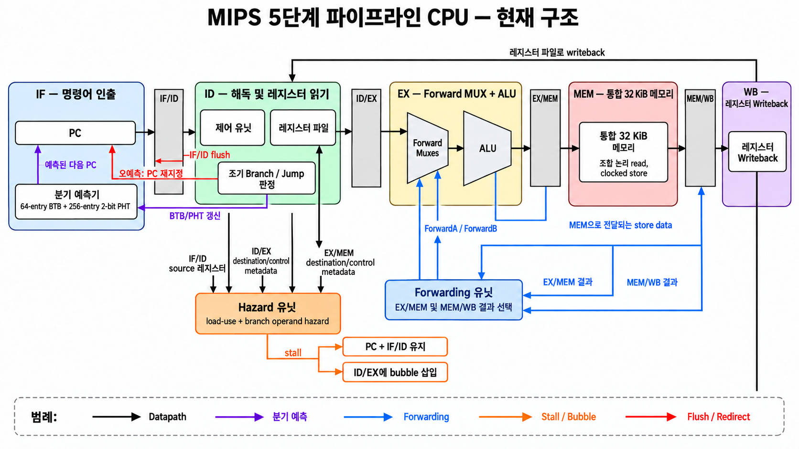
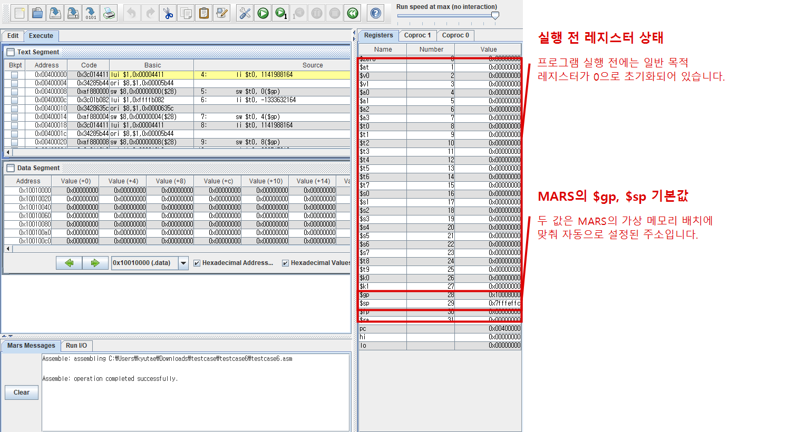
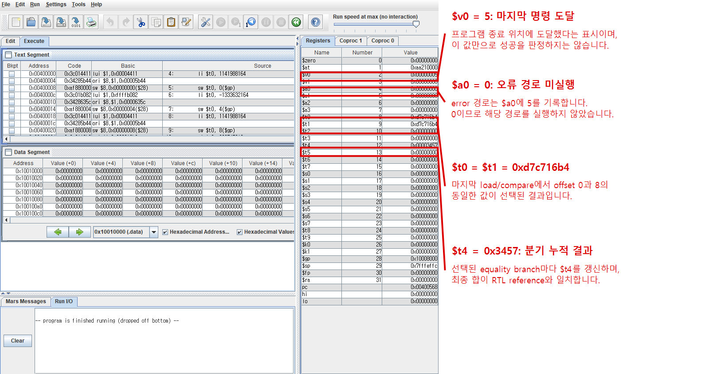

Read this in: [English](README.md) | **한국어**

# MIPS Pipeline과 Out-of-Order Microarchitecture

5단계 in-order MIPS CPU를 cycle-accurate microarchitecture 실험 환경으로 확장한 Verilog 프로젝트입니다. 현재 같은 ISA subset과 지연 메모리 계층을 사용하는 두 코어가 있습니다.

- `CPU.v`: 5단계 in-order pipeline (`IF–ID–EX–MEM–WB`)
- `core_ooo.v`: ROB 기반 non-speculative, single-issue out-of-order 코어



## 구현 범위

In-order 코어에는 EX/MEM·MEM/WB forwarding, register-file forwarding, load-use 및 branch-operand stall, ID-stage branch resolution, misprediction flush, 64-entry BTB, 256-entry 2-bit PHT를 구현했습니다.

OoO 코어에는 16-entry ROB, 8-entry issue queue, RAT 기반 register renaming, single CDB, load/ALU의 out-of-order execution, in-order commit을 구현했습니다. ROB를 훑는 conservative LSQ가 주소 미확정 older store 뒤의 load를 막고, 주소가 같으면 가장 가까운 older store의 값을 forwarding합니다. Control-flow instruction은 speculative recovery 대신 dispatch barrier를 사용합니다.

두 코어는 설정 가능한 지연의 request/response memory interface와 다음 L1 D-cache를 공유합니다.

- 32 sets × 2 ways × 16-byte lines, 총 1 KiB
- blocking, outstanding miss 1개
- write-back/write-allocate
- way별 valid/dirty bit와 true LRU
- dirty victim의 4-word writeback 완료 후 refill

Instruction fetch는 아직 공유 32 KiB backing memory에 직접 연결됩니다.

지원 명령어는 `ADDU`, `SUBU`, `AND`, `OR`, `XOR`, `NOR`, `SLL`, `SRL`, `SRA`, `SLT`, `SLTU`, `JR`, `LW`, `SW`, `ADDIU`, `SLTI`, `SLTIU`, `LUI`, `ANDI`, `ORI`, `XORI`, `BEQ`, `BNE`, `J`, `JAL`입니다.

## 검증

`CPU_tb.v`와 `CORE_OOO_tb.v`는 최종 register state, architectural memory state, retire trace를 독립적으로 생성한 reference와 비교합니다. `halt` 시점에 dirty cache line이 남을 수 있으므로 valid dirty L1 line을 backing memory 위에 overlay한 뒤 메모리를 검사합니다. OoO testbench는 ROB accounting, 중복 writeback, committed-store/request invariant도 확인합니다.

개발 중 두 코어에서 로컬로 총 25개 프로그램을 실행했습니다. pipeline hazard, control flow, ROB/RAT/IQ/CDB, memory ordering, cache replacement를 다루는 자체 작성 directed test 16개, 수업 testcase 7개, 성능 프로그램 2개이며 모두 통과했고 OoO invariant violation은 0건입니다. 자체 test 16개는 저장소에 포함하며, 수업 프로그램과 machine-readable reference dump는 포함하지 않습니다.

### MARS 레지스터 상태 교차 검증

Architectural result를 직접 확인하기 위해 같은 수업 testcase를 MARS에서도 실행했습니다. 실행 전 일반 목적 레지스터는 0이며, 화면의 `$gp`와 `$sp`는 MARS가 제공하는 기본값입니다.



실행 후 `$t0`와 `$t1`에는 예상한 마지막 동일 값이 남고, `$t4 = 0x3457`에는 선택된 branch path의 누적 결과가 저장됩니다. `$a0 = 0`은 error path를 실행하지 않았음을, `$v0 = 5`는 마지막 명령어에 도달했음을 나타냅니다. 이 값들은 RTL reference state와 일치합니다.



아래는 1-cycle memory와 cache bypass를 사용한 수업 testcase baseline 기록입니다.

```console
$ iverilog -DMEM_LATENCY_TB=1 -DDCACHE_BYPASS_TB=1 -o cpu_sim CPU.v CTRL.v ALU.v RF.v MEM.v DCACHE.v FORWARD.v HAZARD.v CPU_tb.v
$ cd testcase/testcase6
$ vvp ../../cpu_sim
cycles = 279
PASS: architectural state matches reference
```

기본 cache 설정은 5-cycle memory를 사용합니다. OoO 코어는 in-order 코어와 별도로 build합니다.

```console
$ iverilog -DMEM_LATENCY_TB=5 -DDCACHE_BYPASS_TB=0 -o cpu_sim CPU.v CTRL.v ALU.v RF.v MEM.v DCACHE.v FORWARD.v HAZARD.v CPU_tb.v
$ iverilog -DMEM_LATENCY_TB=5 -DDCACHE_BYPASS_TB=0 -o ooo_sim core_ooo.v CTRL.v ALU.v MEM.v DCACHE.v CORE_OOO_tb.v
```

## 현재 한계

현재 memory hierarchy는 blocking L1 D-cache까지 구현되어 있습니다. Committed store buffer, merging write-back buffer, unified L2, transaction ID 기반 multiple-outstanding memory, MSHR, I-cache, multicore coherence는 계획 단계입니다. OoO 코어는 single-issue이며 branch를 가로지르는 speculation은 하지 않습니다. 검증은 simulation 기반이고 FPGA 합성 및 보드 테스트는 진행하지 않았습니다.
