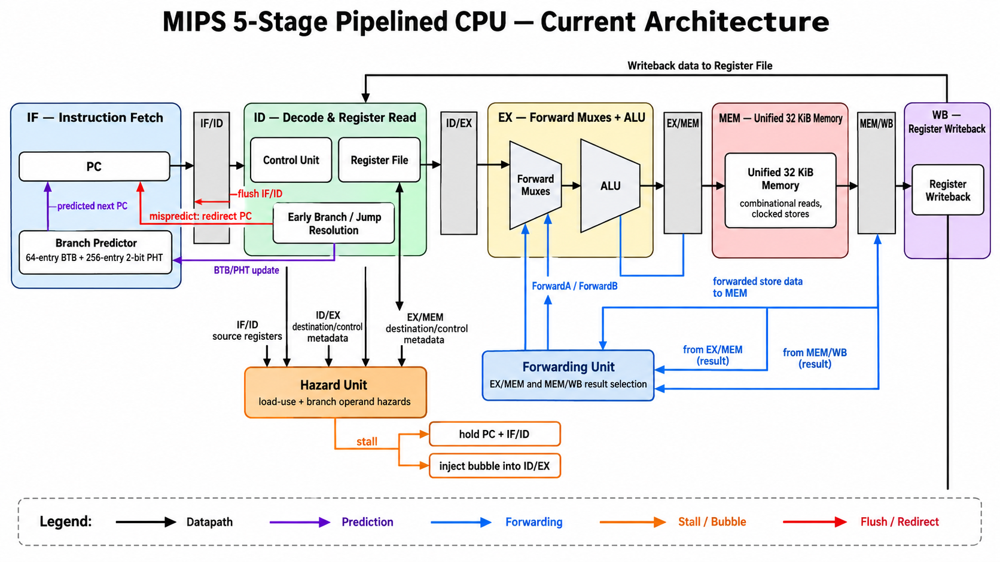

Read this in: **English** | [한국어](README.ko.md)

# MIPS Pipeline and Out-of-Order Microarchitecture

This Verilog project extends a five-stage in-order MIPS CPU into a small, cycle-accurate microarchitecture platform. It now includes two cores that execute the same ISA subset and share the same latency-aware memory system:

- `CPU.v`: five-stage in-order pipeline (`IF–ID–EX–MEM–WB`)
- `core_ooo.v`: ROB-based, non-speculative, single-issue out-of-order core



## Implemented

The in-order core includes EX/MEM and MEM/WB forwarding, register-file forwarding, load-use and branch-operand stalls, ID-stage branch resolution, misprediction flushing, a 64-entry BTB, and a 256-entry 2-bit PHT.

The OoO core includes a 16-entry ROB, 8-entry issue queue, RAT-based register renaming, a single CDB, out-of-order load/ALU execution, and in-order commit. Its conservative ROB-scanning LSQ blocks loads behind unresolved older stores and forwards from the youngest matching store. Control-flow instructions use a dispatch barrier instead of speculative branch recovery.

Both cores use a configurable-latency request/response memory interface and a shared 1 KiB L1 D-cache:

- 32 sets × 2 ways × 16-byte lines
- blocking, one outstanding miss
- write-back and write-allocate
- true LRU with per-way valid and dirty bits
- four-word dirty-victim writeback before refill

Instruction fetch still accesses the shared 32 KiB backing memory directly.

Supported instructions are `ADDU`, `SUBU`, `AND`, `OR`, `XOR`, `NOR`, `SLL`, `SRL`, `SRA`, `SLT`, `SLTU`, `JR`, `LW`, `SW`, `ADDIU`, `SLTI`, `SLTIU`, `LUI`, `ANDI`, `ORI`, `XORI`, `BEQ`, `BNE`, `J`, and `JAL`.

## Verification

`CPU_tb.v` and `CORE_OOO_tb.v` compare the final register state, architectural memory state, and retire trace against independently generated references. Because dirty cache lines can remain at `halt`, the testbenches overlay valid dirty L1 lines on backing memory before checking memory contents. The OoO testbench also checks ROB accounting, duplicate writeback, and committed-store/request invariants.

During development, 25 programs were run locally on both cores: 16 self-authored directed tests (pipeline hazards, control flow, ROB/RAT/IQ/CDB behavior, memory ordering, cache replacement), seven course tests, and two performance programs. All passed, with zero OoO invariant violations. These programs and their reference images are not included in this repository.

The preserved course-test baseline below uses one-cycle memory with the cache bypassed:

```console
$ iverilog -DMEM_LATENCY_TB=1 -DDCACHE_BYPASS_TB=1 -o cpu_sim CPU.v CTRL.v ALU.v RF.v MEM.v DCACHE.v FORWARD.v HAZARD.v CPU_tb.v
$ cd testcase/testcase6
$ vvp ../../cpu_sim
cycles = 279
PASS: architectural state matches reference
```

The default cached configuration uses 5-cycle memory. The OoO core is built separately from the in-order core:

```console
$ iverilog -DMEM_LATENCY_TB=5 -DDCACHE_BYPASS_TB=0 -o cpu_sim CPU.v CTRL.v ALU.v RF.v MEM.v DCACHE.v FORWARD.v HAZARD.v CPU_tb.v
$ iverilog -DMEM_LATENCY_TB=5 -DDCACHE_BYPASS_TB=0 -o ooo_sim core_ooo.v CTRL.v ALU.v MEM.v DCACHE.v CORE_OOO_tb.v
```

## Current boundary

The current memory hierarchy ends at the blocking L1 D-cache. A committed store buffer, merging write-back buffer, unified L2, multiple-outstanding memory transactions, MSHRs, I-cache, and multicore coherence are planned but not implemented. The OoO core remains single-issue and non-speculative across branches. Verification is simulation-based; FPGA synthesis and board testing have not been performed.
