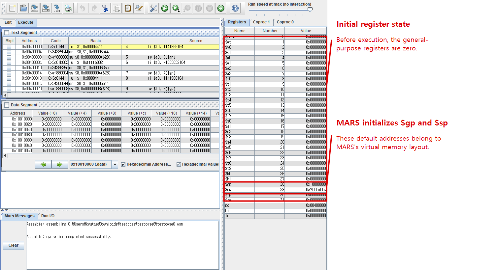
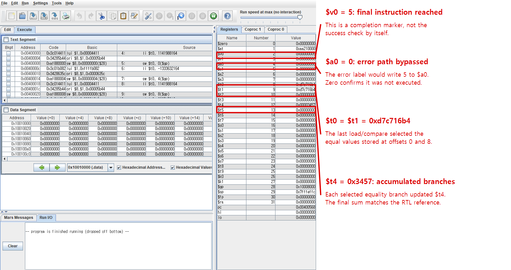

Read this in: **English** | [한국어](README.ko.md)

# MIPS 5-Stage Pipelined CPU

This project implements a single-issue, in-order MIPS CPU in Verilog. It began as a conventional five-stage pipeline and was extended with data forwarding, focused hazard detection, early branch resolution, and dynamic branch prediction.

The pipeline follows `IF -> ID -> EX -> MEM -> WB`. The current memory model is intentionally simple: instructions and data share a flat 32 KiB array with combinational reads. Cache behavior and variable memory latency are not part of this version.

## Design highlights

The forwarding unit selects results from the EX/MEM and MEM/WB stages before they reach the ALU. The register file also handles a write and a read of the same register in one cycle. With those paths in place, the hazard unit only stalls for load-use dependencies and for branch operands that are not yet available.

Branches are resolved in the ID stage. A 64-entry direct-mapped branch target buffer supplies candidate targets, while a 256-entry table of 2-bit saturating counters predicts conditional-branch direction. A mismatch between the prediction and the ID-stage result redirects the PC and flushes the younger instruction.

The supported instruction subset is:

- R-type: `ADDU SUBU AND OR XOR NOR SLL SRL SRA SLT SLTU JR`
- I-type: `LW SW ADDIU SLTI SLTIU LUI ANDI ORI XORI BEQ BNE`
- J-type: `J JAL`

`CPU.v` contains the datapath, pipeline registers, and predictor state. Control decoding is in `CTRL.v`; `ALU.v`, `RF.v`, and `MEM.v` implement the execution, register, and memory blocks. Forwarding and stall decisions are isolated in `FORWARD.v` and `HAZARD.v`, with instruction constants in `GLOBAL.v`.

## Verification

### Icarus Verilog

[`CPU_tb.v`](CPU_tb.v) is a self-checking testbench. It runs the processor until `halt`, then compares all 32 registers and all 8,192 memory words with reference dumps. The complete assembly programs and reference images are course material and are therefore not committed to this repository; representative excerpts from one randomized testcase are shown below instead.

The following run was performed with Icarus Verilog on course testcase 6:

```console
$ iverilog -o cpu_sim CPU.v CTRL.v ALU.v RF.v MEM.v FORWARD.v HAZARD.v CPU_tb.v
$ cd testcase/testcase6
$ vvp ../../cpu_sim
cycles = 279
PASS: architectural state matches reference
```

**`cycles = 279`** is the measured runtime for this program with 48 branches, 56 jumps, 96 loads, and 32 stores, while forwarding, load-use stalls, and BTB/PHT prediction were all enabled. The testbench reached `halt` without a timeout and completed the full register/memory comparison without reporting a mismatch. The MARS cross-check below makes the relevant architectural results visible rather than relying only on the final `PASS` message.

### MARS ISA cross-check

The same program was also run in MARS as an ISA-level cross-check. Testcase 6 repeatedly stores four values, loads pairs back into `$t0` and `$t1`, and branches when it finds the equal pair. Each selected branch adds a path-specific immediate to `$t4`.

The opening group stores the same value at offsets 0 and 8. Loading those locations makes the second comparison true and selects `eq_0_0_2`:

```diff
  li    $t0, 1141988164
  sw    $t0, 0($gp)            # first candidate
  li    $t0, -1333632164
  sw    $t0, 4($gp)
  li    $t0, 1141988164
  sw    $t0, 8($gp)            # duplicate of offset 0

+ lw    $t0, 0($gp)            # reload the first value
+ lw    $t1, 8($gp)            # reload its duplicate
+ beq   $t0, $t1, eq_0_0_2    # equal: select this branch

  eq_0_0_2:
+ addiu $t4, $t4, 26827        # accumulate the selected path
```

The final group follows the same pattern. Its equal pair contains decimal `-674818380`, represented as `0xd7c716b4`, so both `$t0` and `$t1` retain that value. A failed search would set `$a0` to 5; the observed `$a0 = 0` shows that the error path was not entered. `$v0 = 5` marks arrival at the final instruction.

```diff
  random_7:
  li    $t0, -674818380
  sw    $t0, 0($gp)
  li    $t0, -674818380
  sw    $t0, 8($gp)

+ lw    $t0, 0($gp)
+ lw    $t1, 8($gp)
+ beq   $t0, $t1, eq_7_0_2    # final equal pair

  eq_7_0_2:
+ addiu $t4, $t4, -366        # final contribution to $t4
+ j     random_8              # bypass the error marker

  error:
+ li    $a0, 5                # written only if no pair matched
  random_8:
+ li    $v0, 5                # final instruction reached
```

Before execution, the general-purpose registers are zero. The visible `$gp` and `$sp` values are defaults supplied by MARS for its virtual address space, not results produced by the test program.

MARS before execution:



MARS after execution:



After execution, `$a0 = 0` confirms that the error label was bypassed, while `$v0 = 5` shows that control reached the final instruction. `$t0` and `$t1` contain the expected final pair, and `$t4 = 0x3457` is the accumulated result of all selected branches. These program-produced values match the RTL reference dump. `$gp` and `$sp` still differ from the RTL environment because the two simulators use different initial memory layouts.

## Current scope

The CPU has been verified in simulation. It has not yet been synthesized for an FPGA or tested on hardware. The next development stages are documented in [`plan.md`](plan.md), beginning with retire-trace verification and a latency-aware memory interface before adding caches and an out-of-order core.
